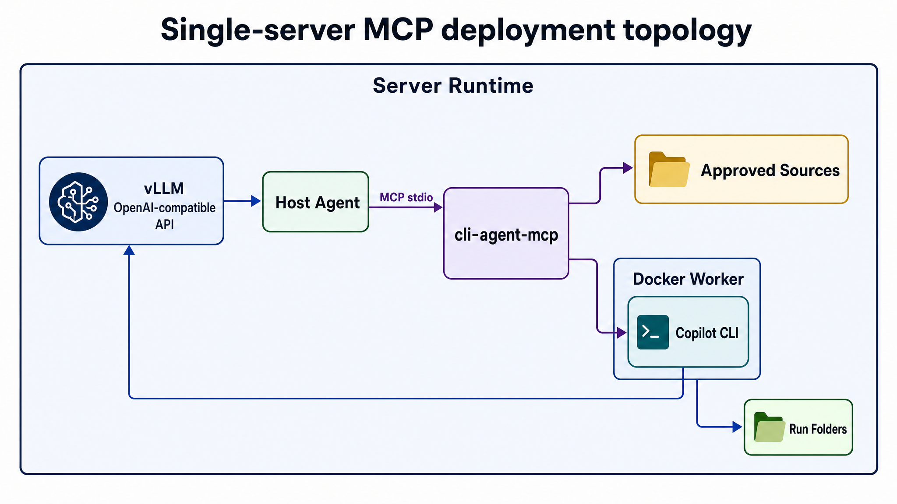

# cli-agent MCP Deployment Guide

Deploy `cli-agent` as an MCP stdio tool server for source-backed search and analysis. The MCP host
owns the outer conversation. `cli-agent` validates approved source paths, prepares an isolated run
folder, starts a contained Docker worker, and returns structured JSON tool results.



---

## Deployment Shape

`cli-agent` exposes two MCP tools:

- `source_search`: source-backed lookup with citations from approved files.
- `auto_analysis`: source-backed analysis or calculation, with optional reports and artifacts.

The deployed single-server topology is:

```text
vLLM OpenAI-compatible API
  -> Host/general agent
       -> MCP stdio subprocess: poetry run cli-agent-mcp
            -> approved source validation
            -> per-run folder under python-agent-runs/
            -> Docker worker container
                 -> Copilot CLI
                 -> same vLLM OpenAI-compatible API
```

The MCP process must run from the repository root so relative approved-source paths and run-folder
paths resolve predictably.

---

## Linux Host Prerequisites

Install these on the deployment server:

- Linux server with enough CPU, RAM, disk, and GPU capacity for the selected vLLM model.
- Python 3.11 or newer.
- Poetry 2.x.
- Docker Engine.
- vLLM, installed in the environment that will serve the model.
- A host MCP client or agent that can launch stdio MCP servers.

Ubuntu-oriented package bootstrap:

```bash
sudo apt-get update
sudo apt-get install -y python3 python3-venv python3-pip git curl ca-certificates
curl -sSL https://install.python-poetry.org | python3 -
```

Install Docker Engine using your distro's supported package flow, then ensure the service account
that runs the MCP host can start containers:

```bash
sudo usermod -aG docker cliagent
```

Log out and back in, or restart the service session, before relying on the new Docker group.

---

## Install the Repository

Use a stable server path. `/srv/cli-agent` is assumed throughout this guide.

```bash
sudo install -d -o "$USER" -g "$USER" /srv/cli-agent
git clone <repo-url> /srv/cli-agent
cd /srv/cli-agent
poetry install --without dev
```

Build the worker image on the Linux server:

```bash
docker build -t cli-agent-worker:local worker
```

Rebuild this image after changing `worker/Dockerfile` or when refreshing the bundled worker
runtime.

---

## Start vLLM

Run the model server before the MCP host starts tool calls. For a single-host Linux deployment,
binding vLLM to loopback and running workers with Docker host networking is the simplest setup:

```bash
vllm serve Qwen3.6-27B \
  --host 127.0.0.1 \
  --port 8000 \
  --served-model-name Qwen3.6-27B
```

Confirm the host can see the model endpoint:

```bash
curl -fsS http://127.0.0.1:8000/v1/models
```

Confirm Docker workers can reach the same endpoint through host networking:

```bash
docker run --rm --network host curlimages/curl:latest \
  http://127.0.0.1:8000/v1/models
```

If that Docker check fails, fix vLLM binding, Docker permissions, or host firewall policy before
registering the MCP server.

---

## Configure the MCP Environment

For a single Linux server, use Docker host networking so the worker can call the loopback vLLM
endpoint:

```bash
export CLI_AGENT_DOCKER_NETWORK=host
export COPILOT_PROVIDER_BASE_URL=http://127.0.0.1:8000/v1
export COPILOT_MODEL=Qwen3.6-27B
export COPILOT_OFFLINE=true
export CLI_AGENT_APPROVED_SOURCES_PATH=settings/approved_sources.json
```

Set `COPILOT_PROVIDER_API_KEY` only when the worker provider requires a bearer token. A local vLLM
server usually does not.

The controller chat variables are only needed by code paths that run the bundled chat controller,
but keeping them aligned is useful for smoke tests:

```bash
export CLI_AGENT_CHAT_BASE_URL=http://127.0.0.1:8000/v1
export CLI_AGENT_CHAT_MODEL=Qwen3.6-27B
export CLI_AGENT_CHAT_API_KEY=not-needed
```

For hardened deployments, replace `CLI_AGENT_DOCKER_NETWORK=host` with a verified Docker network or
host firewall profile and point `COPILOT_PROVIDER_BASE_URL` at the endpoint reachable from that
network.

---

## Register the MCP Server

Configure the host agent to launch `cli-agent` as a stdio MCP server from `/srv/cli-agent`.
Exact syntax varies by MCP host, but the required shape is:

```json
{
  "mcpServers": {
    "cli-agent": {
      "command": "poetry",
      "args": ["run", "cli-agent-mcp"],
      "cwd": "/srv/cli-agent",
      "env": {
        "CLI_AGENT_APPROVED_SOURCES_PATH": "settings/approved_sources.json",
        "CLI_AGENT_DOCKER_NETWORK": "host",
        "COPILOT_PROVIDER_BASE_URL": "http://127.0.0.1:8000/v1",
        "COPILOT_MODEL": "Qwen3.6-27B",
        "COPILOT_OFFLINE": "true"
      }
    }
  }
}
```

If the MCP host runs under systemd or another restricted service manager, use the full path to the
`poetry` executable and make sure Docker is available in that service environment.

---

## Approved Sources

`cli-agent` rejects arbitrary paths. Every source path must be listed in the approved-source
manifest and must be repo-relative:

```json
{
  "sources": [
    {
      "path": "sample_sources/dnd5e_hp_reference.md",
      "label": "D&D 5e HP quick reference",
      "description": "Small demo source for hit point calculations and ambiguity checks."
    }
  ]
}
```

Use exact manifest strings in MCP tool calls. A request for an unlisted path fails before Docker
starts.

For larger PDF corpora, prefer chapter-level files instead of one large monolithic PDF. Generate a
server-local manifest with:

```bash
poetry run python scripts/build_approved_sources.py \
  --corpus "corpus/phb/chapters" \
  --output settings/approved_sources.local.json

export CLI_AGENT_APPROVED_SOURCES_PATH=settings/approved_sources.local.json
```

PDF files are copied into each run folder and converted to extracted text with page markers before
the worker starts. Scanned image-only PDFs fail instead of producing guessed answers.

---

## Tool Arguments

Example `source_search` payload:

```json
{
  "question": "What hit point rule applies after level 1?",
  "source_paths": ["sample_sources/dnd5e_hp_reference.md"]
}
```

Example `auto_analysis` payload:

```json
{
  "question": "Calculate expected level 5 paladin hit points with a Constitution modifier of +2 using fixed increases.",
  "source_paths": ["sample_sources/dnd5e_hp_reference.md"],
  "analysis_goal": "Return the calculated hit point total and cite the rule used."
}
```

Both tools require `question` and `source_paths`. `auto_analysis` also accepts `analysis_goal`.

---

## Verify the Deployment

Run this sequence after installation:

```bash
cd /srv/cli-agent
curl -fsS http://127.0.0.1:8000/v1/models
docker run --rm --network host curlimages/curl:latest http://127.0.0.1:8000/v1/models
poetry run python -c "from cli_agent.mcp_server import build_server; build_server(); print('mcp configuration ok')"
```

Then restart the MCP host and verify:

- The MCP host lists `source_search` and `auto_analysis`.
- A valid `source_search` call returns JSON with `status: "success"`, a `run_id`, and cited
  markdown.
- A request for an unapproved path returns an error before a worker container starts.
- A successful run writes `python-agent-runs/<run_id>/output/answer.md`.
- Worker logs are available under `python-agent-runs/<run_id>/output/logs/`.

---

## Run Folders and Results

Each accepted tool call creates one run folder:

```text
python-agent-runs/<run_id>/
  input/
  work/
  output/
    answer.md
    manifest.json
    optional results.csv
    optional graphs/*.png
    logs/
```

Each MCP tool result is JSON text. Important fields include:

- `status`: `success`, `error`, `needs_clarification`, `timeout`, or `capacity_exceeded`.
- `run_id`: folder name under `python-agent-runs/` when a worker run was created.
- `report_markdown`: worker answer or report.
- `artifact_paths`: generated files such as CSVs or graphs.
- `citation_summary`: approved source paths cited by the result.
- `error`: failure text when the run did not succeed.

Run folders are intentionally left on disk for inspection and cleanup. Put retention policy in
place before exposing the tool to sustained traffic.

---

## Runtime Settings

| Setting | Linux deployment value | Purpose |
| --- | ---: | --- |
| `CLI_AGENT_APPROVED_SOURCES_PATH` | `settings/approved_sources.json` | Approved-source manifest. |
| `CLI_AGENT_RUNS_ROOT` | `python-agent-runs/` | Root directory for per-tool run folders. |
| `CLI_AGENT_WORKER_IMAGE` | `cli-agent-worker:local` | Docker image used for worker runs. |
| `CLI_AGENT_DOCKER_NETWORK` | `host` | Docker `--network` value for the single-server loopback vLLM setup. |
| `COPILOT_PROVIDER_BASE_URL` | `http://127.0.0.1:8000/v1` | Worker-visible OpenAI-compatible provider URL when Docker uses host networking. |
| `COPILOT_MODEL` | `Qwen3.6-27B` | Model name passed to the Copilot CLI worker provider. |
| `COPILOT_PROVIDER_API_KEY` | unset | Optional bearer token for the worker provider. |
| `COPILOT_OFFLINE` | `true` | Keeps the worker from contacting GitHub auth or remote Copilot services by default. |
| `CLI_AGENT_MAX_CONCURRENT_WORKER_RUNS` | `2` | Maximum concurrent Docker worker runs per MCP process. |
| `CLI_AGENT_WORKER_QUEUE_TIMEOUT_SECONDS` | `30` | Wait time for a worker slot before returning `capacity_exceeded`. |
| `CLI_AGENT_WORKER_TIMEOUT_SECONDS` | `180` | Maximum runtime for a single worker container. |
| `CLI_AGENT_MAX_SOURCES_PER_RUN` | `4` | Maximum approved source files copied into one run. |
| `CLI_AGENT_MAX_SOURCE_BYTES` | `33554432` | Maximum bytes for one requested source. |
| `CLI_AGENT_MAX_TOTAL_SOURCE_BYTES_PER_RUN` | `67108864` | Maximum total requested source bytes. |
| `CLI_AGENT_CHAT_BASE_URL` | `http://127.0.0.1:8000/v1` | OpenAI-compatible endpoint used by bundled chat-controller paths. |
| `CLI_AGENT_CHAT_MODEL` | `Qwen3.6-27B` | Model name sent by bundled chat-controller paths. |
| `CLI_AGENT_CHAT_API_KEY` | `not-needed` | Bearer token for bundled chat-controller paths. |
| `CLI_AGENT_CHAT_TEMPERATURE` | `0.0` | Temperature for bundled chat-controller completions. |
| `CLI_AGENT_CHAT_TIMEOUT_SECONDS` | `120` | Maximum wait for each bundled chat-controller completion call. |
| `CLI_AGENT_MAX_API_JOBS` | `100` | Maximum retained HTTP chat jobs. |
| `CLI_AGENT_HTTP_BEARER_TOKEN` | unset | Optional bearer token required by the HTTP API when set. |

---

## Worker Containment

Worker containers run with:

- read-only root filesystem
- no added Linux capabilities
- `no-new-privileges`
- init process enabled
- writable `/tmp` limited to 64 MiB
- PID limit of 256
- runtime homes and caches redirected under `/workspace/work`
- only the run folder mounted at `/workspace`

The worker invocation disables remote and built-in MCPs, restricts added directories to
`/workspace`, and exposes only the local tools required for source inspection and artifact writing.

Network restriction is external to the worker container. Do not grant firewall or network-admin
privileges to the model-controlled container. If host networking is too broad for your deployment,
create and verify a narrower network or firewall profile before enabling production traffic.

---

## Troubleshooting

- Tools are missing from the MCP host: check that `CLI_AGENT_APPROVED_SOURCES_PATH` points to a
  valid manifest and that the MCP process starts from `/srv/cli-agent`.
- Tool calls fail before Docker starts: `source_paths` are not exact manifest strings, source limits
  were exceeded, or required arguments are missing.
- Docker starts but the worker cannot answer: verify `COPILOT_PROVIDER_BASE_URL`, Docker networking,
  `COPILOT_MODEL`, and provider authentication.
- Runs return `capacity_exceeded`: increase `CLI_AGENT_MAX_CONCURRENT_WORKER_RUNS`, increase
  `CLI_AGENT_WORKER_QUEUE_TIMEOUT_SECONDS`, or reduce parallel calls from the MCP host.
- Runs time out: increase `CLI_AGENT_WORKER_TIMEOUT_SECONDS`, use smaller approved sources, or reduce
  model load on the vLLM server.

Worker startup and provider errors are usually visible in:

```text
python-agent-runs/<run_id>/output/logs/copilot.stderr.log
python-agent-runs/<run_id>/output/logs/copilot.stdout.log
```

---

## Production Checklist

- Run the MCP host and worker image from a dedicated Linux service account.
- Keep the approved-source manifest under change control.
- Use source-size limits appropriate for the server and model context.
- Put retention or archival policy around `python-agent-runs/`.
- Monitor vLLM health, GPU memory, queue depth, worker timeouts, and disk usage.
- Restrict network reachability outside the model provider path.
- Keep `COPILOT_PROVIDER_API_KEY` and any provider credentials in the host service environment, not
  in committed files.
- Rebuild and redeploy the worker image after dependency or Dockerfile changes.

---

## Development Verification

Run the test suite from the repository root:

```bash
poetry install
poetry run pytest
```

## Next.js Frontend PoC

The `frontend/` directory contains a barebones Next.js UI intended for Vercel preview deployments.
It does not replace the Python/Docker runtime. Start the Python HTTP wrapper from this repository,
then run the frontend separately:

```bash
poetry run cli-agent-http
cd frontend
npm install
npm run dev
```

The frontend defaults to a same-origin proxy at `/api/backend`. For a Vercel demo, set
`CLI_AGENT_BACKEND_URL` to the externally reachable Python HTTP API URL, such as an ngrok URL, and
set `CLI_AGENT_BACKEND_BEARER_TOKEN` to match `CLI_AGENT_HTTP_BEARER_TOKEN` when the Python API token
is enabled. Leave `NEXT_PUBLIC_BACKEND_URL` unset unless you intentionally want browser-direct API
requests. Use `frontend/` as the Vercel project root.
